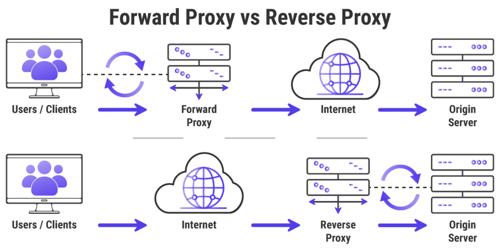

### 1. Javascript closure là gì?
> Closure một chức năng có quyền truy cập vào phạm vi cha, ngay cả sau khi phạm vi đã đóng.

VD: 1
```js
function speak() {
  var words = 'hi';
  return function logIt() {
    console.log(words);
  }
}

const hello = speak()
hello()  // 'hi'
```

Ở ví dụ trên, ta thấy function logIt vẫn truy cập được giá trị `words = 'hi'` ngay cả khi scope của function speak đã đóng.

VD 2:

```js
function name(n) {
  return function(a) {
    return `${n} likes ${a}`;
  };
}

var j = name('John');
var c = name('Cindy');

j('dogs');  // 'John likes dogs'
c('cats');  // 'Cindy likes cats'
```

VD 3:

```js
function f1()
{
    var N = 0; // N luon duoc khoi tao khoi ham f1 dduowcj thuc thi
    console.log(N);
    function f2() // Ham f2
    {
        N += 1; // cong don cho bien N
        console.log('-->>',N);
    }

    return f2;
}

var result = f1();  

result(); // Chay lan 1  --> 1
result(); // Chay lan 2 --> 2
result(); // Chay lan 3 ---> 3
```

#### 2. Javascript: Currying In JavaScript
> Currying is a technique of evaluating function with multiple arguments, into sequence of functions with single argument. In other words, when a function, instead of taking all arguments at one time, takes the first one and return a new function that takes the second one and returns a new function which takes the third one, and so forth, until all arguments have been fulfilled.

```js
const movies = [
  {
    "id": 1,
    "name": "Matrix"
  },
  {
    "id": 2,
    "name": "Star Wars"
  },
  {
    "id": 3,
    "name": "The wolf of Wall Street"
  }
]

const series = [
  {
    "id": 4,
    "name": "South Park"
  },
  {
    "id": 5,
    "name": "The Simpsons"
  },
  {
    "id": 6,
    "name": "The Big Bang Theory"
  }
]

//Không tốt
console.log(series.map((serie) => serie.id)) //should return [ 1, 2, 3 ])

console.log(movies.map((movie) => movie.id)) //should return [ 1, 2, 3 ])

//Tốt 
const get = property => object => object[property];

const getId = get('id'); // if need get name then get('name')

console.log(movies.map(getId)); //should return [ 1, 2, 3 ]
console.log(series.map(getId)); //should return [ 4, 5, 6 ]
```

### 3.  Merge array
- Concat es5:
  
```js
var array1 = [1, 2];
var array2 = [3, 4, 5];
var array3 = array1.concat(array2); // returns a new array
/*
Output:
[1, 2, 3, 4, 5]
*/

Với concat multiple array javascript

var array1 = [1, 2];
var array2 = [3, 4, 5];
var array3 = [6,7,8]
var array4 = array1.concat(array2, array3); // returns a new array
/*
Output:
[1, 2, 3, 4, 5, 6, 7, 8]
*/
```

- Es6
```js
# Với 2 arrays: 

var array1 = [1, 2];
var array2 = [3, 4, 5];
var array3 = [...array1, ...array2]; // returns a new array
/*
Output:
[1, 2, 3, 4, 5]
*/
 # Multiple Arrays 

var array1 = [1, 2];
var array2 = [3, 4, 5];
var array3 = [6,7,8]
var arrConc = [...array1, ...array2, ...array3]
/*
Output:
[1, 2, 3, 4, 5, 6, 7, 8]
*/
 or chúng ta cũng có thể làm như sau và sẽ thay đổi giá trị array ban đầu 

array1.push(...array2, ...array3);//
//Lúc này array1 sẽ có giá trị là [1, 2, 3, 4, 5, 6, 7, 8]
```

- Merge array Object
```js
var arr1 = [{name: "lang", value: "English"},{name: "age", value: "18"}];
var arr2 = [{name : "childs", value: '5'}, {name: "lang", value: "German"}];

Array.prototype.push.apply(arr1,arr2); 
console.log(arr1);

Output:
[{"name":"lang","value":"English"},
{"name":"age","value":"18"},
{"name":"childs","value":"5"},
{"name":"lang","value":"German"}]
```

-  Lấy item của array1 làm key, lấy item của array2 làm value. 
```js
var columns = ["Date", "blog", "name", "Location", "rank"];
var rows = ["2019", "javascript", "anonystick", "Vietnam", "150000"];

var result = rows.reduce(function(result, field, index) {
 result[columns[index]] = field;
 return result;
}, {})
console.log(result);

Output:
{
Date: "2019", 
blog: "javascript", 
name: "anonystick", 
Location: "Vietnam", 
rank: "150000"
}
```

### 4. Forward Proxy & Reverse Proxy
- Forward Proxy: thay mặt cho client
- Reverse Proxy: thay mặt cho server



### 5. Defer và async hiệu quả khi load javascript

- Cả async và defer đều là các thuộc tính boolean. Cách sử dụng của chúng là tương tự nhau: 
```js
<script async src="script.js"></script> 
<script defer src="script.js"></script> 
```
Các attribute này chỉ có ý nghĩa khi sử dụng tập lệnh trong `<head>` của trang và chúng sẽ vô dụng nếu bạn đặt tập lệnh vào phần `</body>`

--> Điều tốt nhất cần làm để tăng tốc độ tải trang của bạn khi sử dụng tập lệnh là đặt chúng vào thẻ <head> và thêm thuộc tính defer vào thẻ script của bạn:
```js
<script defer src="script.js"></script>
```
using `defer`:


### 6. Try catch
- try catch chỉ hoạt động (bắt lỗi) khi 1 function được gọi thực thi trong try
- Không hoạt động với hàm setTimeout (vì khi đó try catch đã chạy xong thì setTimeout mới chạy)


### 7. Xử lý relative imports với jsconfig
- create file jsconfig.json in `root path` of project
- should know how to use include, exclude...
- example config:
```js
{
  "compilerOptions": {
    "module": "commonjs",
    "target": "es6",
    "baseUrl": "./src"
  },
  "include": [
    "src/**/*"
  ]
}
```

### 8. Create custom field using `formik`
- Source: <a href='https://github.com/paulnguyen-mn/redux-photo-app/pull/3/files'>Link code demo</a>


