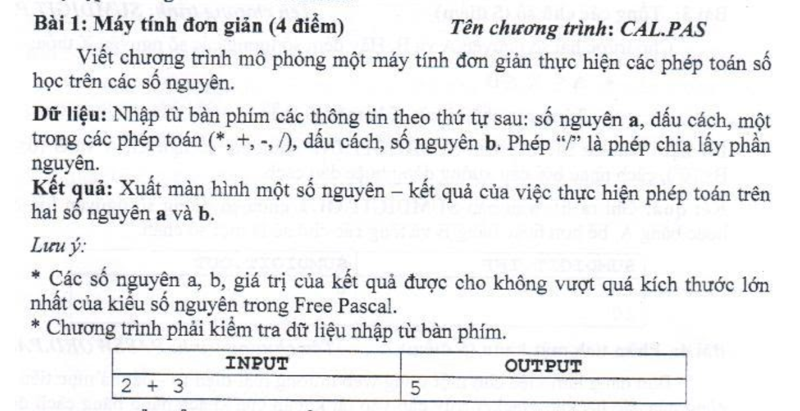
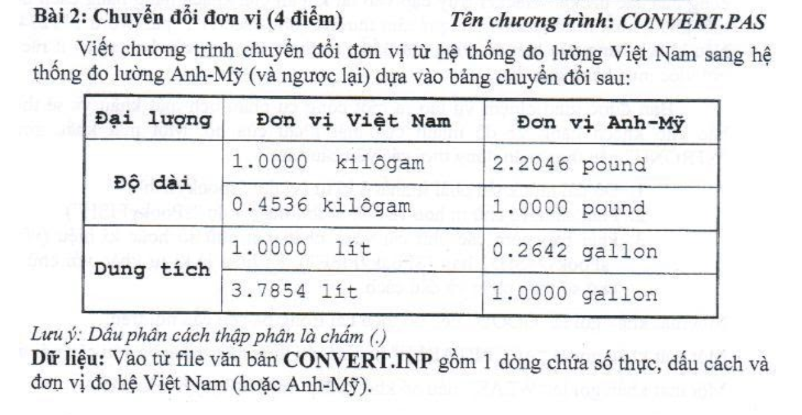
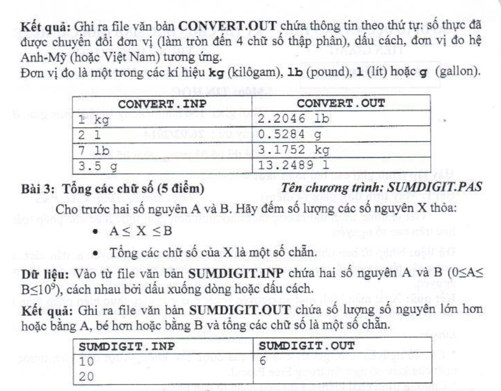
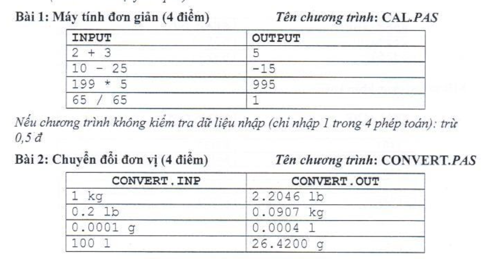
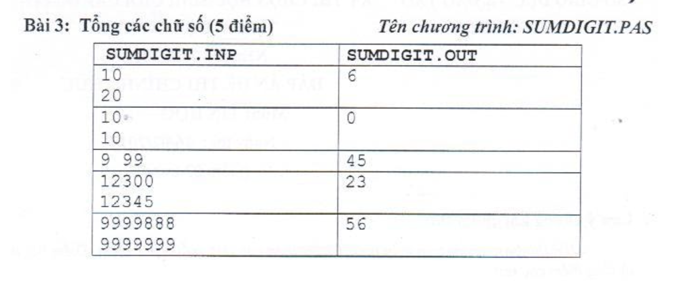

### XỬ LÝ FILE TRONG C
Source: https://viettuts.vn/c-file
**Lợi thế của file**
- Là nơi chứa dữ liệu ngay cả sau khi thoát khỏi chương trình. 
- Biến và mảng là phương tiện lưu trữ không cố định trong khi tệp là phương tiện lưu trữ vĩnh viễn.
- Rất hữu ích khi làm bài tập mà input đầu vào có quá nhiều dữ liệu, dẫn đến mất rất nhiều thời gian cho việc nhập input này, chưa kể cho những lần nhập sai, khó kiểm soát.

#### 1. Các hàm xử lý file trong C
Có nhiều hàm trong thư viện C để mở, đọc, ghi, tìm kiếm và đóng file. Dưới đây là danh sách các chức năng xử lý file trong C:
| #  | Hàm | Mô tả |
| ------------- | ------------- | ------------- |
| 1 | fopen() | mở tệp mới hoặc file đang tồn tại|
| 2 | fprintf()| ghi dữ liệu vào file|
| 3 | fscanf()| đọc dữ liệu từ file|
| 4 | fputc()| ghi một ký tự vào file|
| 5 | fgetc()| đọc một ký tự từ file|
| 6 | fputs()| ghi một chuỗi ký tự vào file|
| 7 | fgets()| đọc một chuỗi ký tự từ file|
| 8 | fclose()| đóng file|
| 9 | fseek()| đặt con trỏ tập tin vào vị trí đã cho|
| 10 | fputw()| ghi một số nguyên vào file|
| 11 | fgetw()| đọc một số nguyên từ file|
| 12| ftell()| trả về vị trí hiện tại|
| 13| rewind()| đặt con trỏ tập tin vào đầu tập tin|

**Mở file: fopen()**
Hàm `fopen()` được sử dụng để mở một file. Cú pháp của hàm fopen() được đưa ra dưới đây:
```c
FILE  * fopen (const char  * tên tập tin,   chế độ const char *);
```
Bạn có thể sử dụng một trong các chế độ (`mode`) sau trong hàm `fopen()`.

| Mode  | Mô tả |
| ------------- | ------------- |
|r	|mở file văn bản ở chế độ đọc|
|w	|mở file văn bản ở chế độ ghi|
|a|	mở file văn bản ở chế độ nối thêm nội dung vào nội dung sẵn có trong file.|
|r+|	mở file văn bản ở chế độ đọc và ghi|
|w+|	mở file văn bản ở chế độ đọc và ghi|
|a+|	mở file văn bản ở chế độ đọc và ghi|
|rb|	mở file văn bản ở chế độ đọc và ghi|
|wb|	mở file nhị phân ở chế độ đọc|
|ab|	mở file nhị phân ở chế độ nối thêm nội dung vào nội dung sẵn có trong file.|
|rb+|	mở file nhị phân ở chế độ đọc và ghi|
|wb+|	mở file nhị phân ở chế độ đọc và ghi|
|ab+|	mở file nhị phân ở chế độ đọc và ghi|

**Đóng file: fclose()**
Cú pháp:
```c
int fclose( FILE *fp ); 
```

**Hàm fscanf và fprintf()**
Hàm fprintf() - Ghi file
>Hàm `fprintf()` trong C được sử dụng để ghi các ký tự vào file. Nó gửi dữ liệu được định dạng tới một stream.
Cú pháp:
```c
int fprintf(FILE *stream, const char *format [, argument, ...])
```

Ví dụ:
```c
#include <stdio.h>
 
int main() {
   FILE *fp;
   // mo file
   fp = fopen("file.txt", "w");
   // ghi du lieu vao file
   fprintf(fp, "Hello C, su dung fprintf()...\n");
   // dong file
   fclose(fp);
   return 0;
}
```

**Hàm fscanf() - Đọc file**
>Hàm `fscanf ()` được sử dụng để đọc tập hợp các ký tự từ file. Nó đọc một từ trong file và trả về EOF ở vị trí kết thúc file.

Cú pháp:
```c
int fscanf(FILE *stream, const char *format [, argument, ...])
```

**Ví dụ 1:**
```c
#include <stdio.h>
 
int main() {  
   FILE *fp;
   char buff[255];
   fp = fopen("file.txt", "r");
   while (fscanf(fp, "%s", buff) != EOF) {
      printf("%s ", buff);
   }
   fclose(fp);
   return 0;
}
```

Kết quả:
```c
Hello C, su dung fprintf()...
```

**Ví dụ 2:** đọc thông tin sinh viên:
Giả sử chúng ta có file `sinhvien.txt` có nội dung như sau:
```c
Name: Vinh		ID: 1		Marks: 7.5
Name: Phuc		ID: 3		Marks: 9.0
Name: Phi		ID: 2		Marks: 10
Name: Manh		ID: 4		Marks: 9.5
Name: Thang		ID: 5		Marks: 8.0
```

Sau đây là chương trình đọc file `sinhvien.txt`:
```c
#include<stdio.h>
 
int main() {
    FILE *fp;
    char name[50];
    int id;
    float marks;
  
    fp = fopen("sinhvien.txt", "r");
  
    if(fp == NULL) {
        printf("Error opening file\n");
        exit(1);
    }
  
    printf("Vi du su dung ham fscanf(): \n\n");
    printf("Name:\t\tID\t\tMarks\n");
     
    // doc thong tin sinh vien
    while( fscanf(fp, "Name: %s\t\tID: %d\t\tMarks: %f\n"
                    , name, &id, &marks) != EOF )
    {
        printf("%s\t\t%d\t\t%.2f\n", name, id ,marks);
    }
  
    fclose(fp);
    return 0;
}
```

Ví dụ file trong C - **Lưu trữ thông tin nhân viên**
Dưới đây là một ví dụ xử lý tệp để lưu trữ thông tin sinh viên khi người dùng nhập từ console. Chúng ta sẽ lưu trữ id, name và salary của nhân viên.
```c
#include <stdio.h>
 
int main() {  
    FILE *fptr;
    int id;
    char name[30];
    int salary;
     
    fptr = fopen("emp.txt", "w+");
     
    if (fptr == NULL) {
        printf("File khong ton tai.\n");
        return;
    }
     
    printf("Nhap id: ");
    scanf("%d", &id);
    fprintf(fptr, "Id = %d\n", id);
    printf("Nhap name: ");
    scanf("%s", name);
    fprintf(fptr, "Name = %s\n", name);
    printf("Nhap salary: ");
    scanf("%f", &salary);
    fprintf(fptr, "Salary = %.2f\n", salary);
     
    fclose(fptr);
    return 0;
}
```

Kết quả:
```c
Nhap id: 1001
Nhap name: David
Nhap salary: 12000
```
File `emp.txt`
```c
Id = 1001
Name = David
Salary = 12000.00
```


**Hàm fgets() và fputs() - Đọc và ghi một chuỗi ký tự vào file**
>Hàm fputs() trong C được sử dụng để ghi một chuỗi ký tự vào file.
Cú pháp:
```c
int fputs(const char  * s,  FILE  * stream)
```
Ví dụ:
```c
#include <stdio.h>
 
int main() {
   FILE *fp;
   // open file
   fp = fopen("file2.txt", "w");
   // write string into file
   fputs("hello c programming!", fp);
   // close file
   fclose(fp);
   return 0;
}
```

>Hàm fgets() trong C được sử dụng để đọc một dòng ký tự từ một file đã cho.
Cú pháp:
```c
char* fgets(char *s, int n, FILE *stream)
```

Ví dụ:
```c
#include<stdio.h>
#include<conio.h>
 
int main(){
 FILE *fp;
 char text[300];
 
 fp=fopen("file2.txt", "r");
 printf("%s",fgets(text,200,fp));
 
 fclose(fp);
 getch();
 return 0;
}
```
Kết quả:
```c
hello c programming!
```

**Hàm rewind() trong C - Di chuyển con trỏ về vị trí đầu file**
Cú pháp:
```c
void rewind(FILE *stream);
```

Ví dụ:
File: `myfile.txt`
```c
Hoc lap trinh C,
```
File: `rewind.cpp`:
```c
#include<stdio.h>
#include<conio.h>
 
int main() {
    FILE *fp;
    char c;
 
    fp=fopen("myfile.txt","r");
     
    while ((c = fgetc(fp)) != EOF){
        printf("%c", c);
    }
     
    // di chuyen con tro file ve vi tri dau tien
    rewind(fp);
     
    while ((c = fgetc(fp)) != EOF){
        printf("%c", c);
    }
     
    fclose(fp);
    getch();
    return 0;
}
```

Kết quả:
```c
Hoc lap trinh C,Hoc lap trinh C,
```

#### BÀI TẬP
**Hãy giải các bài tập sau (có nhập xuất file đầy đủ)**







