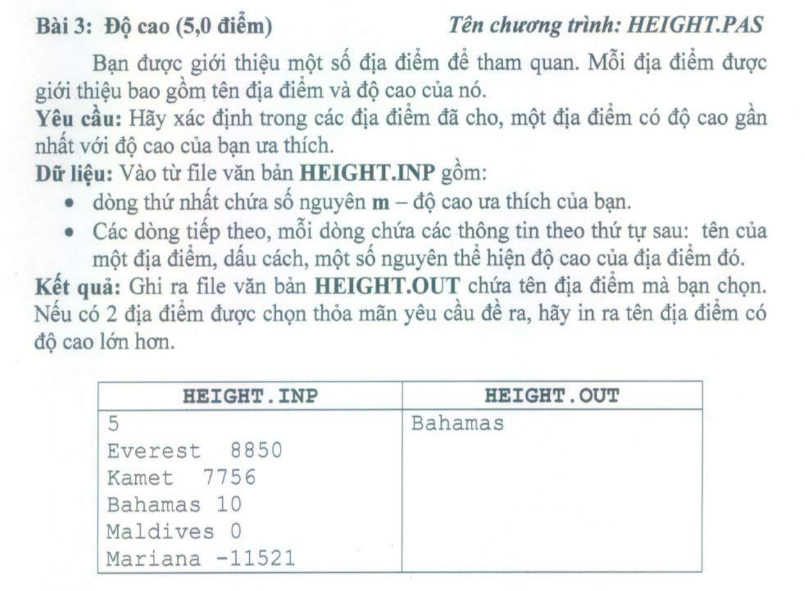

## STRUCT TRONG C

Khi nào chúng ta cần phải tự định nghĩa 1 kiểu cấu trúc? 
- Khi bạn cần lưu trữ một đối tượng có nhiều thuộc tính. 
- Ví dụ, đối tượng SinhVien có các thuộc tính (Mã sinh viên, họ, tên, giới tính, quê quán,…) hay đối tượng LopHoc có các thuộc tính (Mã lớp, tên lớp, giáo viên chủ nhiệm, sĩ số,…). Khi đó chúng ta nên dùng struct để quản lý chương trình.

**Cú pháp định nghĩa struct trong C**
```c
struct structureName 
{
    dataType member1;
    dataType member2;
    ...
};
```
Dưới đây là 1 ví dụ:
```c
struct SinhVien {
    int maSV;
    char ho[20];
    char ten[20];
    bool gioiTinh;
    char queQuan[100];
};
```

Như vậy, kiểu dữ liệu `SinhVien` đã được định nghĩa. Từ đây chúng ta có thể khai báo các biến với kiểu dữ liệu này.

**Cách khai báo biến kiểu struct trong C**
Việc khai báo biến với struct cũng giống như cách khai báo biến thông thường, trong đó kiểu dữ liệu là kiểu struct trong C mà bạn vừa định nghĩa. Xem ví dụ dưới đây:
```c
struct SinhVien
{
    int maSV;
    char ho[20];
    char ten[20];
    bool gioiTinh;
    char queQuan[100];
};
 
int main(){
    // Khai báo 2 biến sv1 và sv2 có kiểu SinhVien
    SinhVien sv1, sv2;
 
    // Ta nên thêm từ khóa struct ở đầu,
    // để phân biệt được biến này là biến của kiểu dữ liệu tự định nghĩa
    struct SinhVien sv3, sv4;
 
    // Khai báo mảng
    struct SinhVien sv[100];
}
```
**Truy xuất các thuộc tính của struct**
Chúng ta có 2 toán tử dùng để truy xuất tới các biến thành viên của kiểu struct trong C.
- Sử dụng . : Toán tử truy xuất tới thành viên khi khai báo biến bình thương.
- Sử dụng -> : Toán tử truy xuất tới thành viên khi biến là con trỏ.

Giả sử trong ví dụ trên, bạn muốn truy xuất `gioiTinh` của đối tượng sinh viên, bạn làm như sau:
```c
SinhVien sv;
// to do
printf("Gioi tinh: %s", sv.gioiTinh);
```

**Từ khóa typedef**
- Sử dụng từ khóa `typedef` để tạo ra một tên thay thế cho kiểu dữ liệu đã có
- Nó thường được sử dụng kiểu struct để đơn giản hóa cú pháp khai báo biến. Nhưng nó cũng có thể sử dụng với các kiểu dữ liệu nguyên thủy nhé.

```c
struct Distance{
    int feet;
    float inch;
};
 
int main() {
    structure Distance d1, d2;
}
```

Code trên tương đương với:
```c
typedef struct SinhVien{
    int feet;
    float inch;
} distances;
 
int main() {
    distances d1, d2;
}
```
Hoặc:
```c
struct PhanSo{
    int tu;
    int mau;
};
 
typedef struct PhanSo PS;
```

Hoặc bạn có thể dùng với kiểu nguyên thủy như sau:
```c
typedef int U_INT8;
 
// Khai báo biến kiểu int
U_INT8 value;
```

**Cấu trúc struct lồng nhau**
Giả sử bạn muốn xây dựng kiểu dữ liệu để lưu trữ đối tượng `Tam giác`, khi đó chúng ta có thể xây dựng struct mô tả tọa độ của 1 điểm, khi đó đối tượng tam giác sẽ là 3 đối tượng điểm. Cụ thể:
```c
struct Point{
    int x; // hoành độ
    int y; // tung độ
};
 
struct Triangle{
    Point a; // đỉnh thứ 1
    Point b; // đỉnh thứ 2
    Point c; // đỉnh thứ 3
}
 
int main(){
    Triangle tg;
    
    // truy xuất hoành độ của điểm thứ nhất
    tg.a.x = 5;
}
```

**Chương trình cộng trừ nhân chia phân số trong C**
```c++
#include <stdio.h>
#include <string.h>
#include <math.h>
 
int UCLN(int a, int b)
{
    a = abs(a);
    b = abs(b);
    while (a != b){
      a > b ? a-=b : b-=a;
    }
    return a;
}
 
int BSCNN(int a, int b)
{
    return a * b / UCLN(a, b);
}
 
typedef struct PhanSo
{
    int tuso, mauso;
} PS;
 
PS rutGon(PS a)
{
    PS c;
    c.tuso = a.tuso / UCLN(a.tuso, a.mauso);
    c.mauso = a.mauso / UCLN(a.tuso, a.mauso);
    return c;
}
 
PS cong(PS a, PS b)
{
    PS c;
    c.tuso = a.tuso * b.mauso + a.mauso * b.tuso;
    c.mauso = a.mauso * b.mauso;
    c = rutGon(c);
    return c;
}
 
PS tru(PS a, PS b)
{
    PS c;
    c.tuso = a.tuso * b.mauso - a.mauso * b.tuso;
    c.mauso = a.mauso * b.mauso;
    c = rutGon(c);
    return c;
}
 
PS nhan(PS a, PS b)
{
    PS c;
    c.tuso = a.tuso * b.tuso;
    c.mauso = a.mauso * b.mauso;
    c = rutGon(c);
    return c;
}
 
PS chia(PS a, PS b)
{
    PS c;
    c.tuso = a.tuso * b.mauso;
    c.mauso = a.mauso * b.tuso;
    c = rutGon(c);
    return c;
}
void print(PS a)
{
    printf("%d/%d", a.tuso, a.mauso);
}
int main()
{
    PS a, b, c;
 
    printf("\nNhap phan so a : ");
    scanf("%d%d", &a.tuso, &a.mauso);
    printf("\nNhap phan so b : ");
    scanf("%d%d", &b.tuso, &b.mauso);
    printf("\nToi gian a ta duoc : ");
    a = rutGon(a);
    print(a);
    printf("\nToi gian b ta duoc : ");
    b = rutGon(b);
    print(b);
    printf("\nTong cua hai phan so = ");
    c = cong(a, b);
    print(c);
    printf("\nHieu cua hai phan so = ");
    c = tru(a, b);
    print(c);
    printf("\nTich cua hai phan so = ");
    c = nhan(a, b);
    print(c);
    printf("\nThuong cua hai phan so = ");
    c = chia(a, b);
    print(c);
}
```
Kết quả chạy:
```c++
Nhap phan so a : 3
4
 
Nhap phan so b : 2
3
 
Toi gian a ta duoc : 3/4
Toi gian b ta duoc : 2/3
Tong cua hai phan so = 17/12
Hieu cua hai phan so = 1/12
Tich cua hai phan so = 1/2
Thuong cua hai phan so = 9/8
```

**Struct và con trỏ**
Chúng ta cũng có thể khai báo biến con trỏ, cấp phát động cho biến con trỏ kiểu struct.
Sau đây là cách chúng ta khai báo biến con trỏ kiểu struct trong C:
```c++
struct name {
    member1;
    member2;
    .
    .
};
int main()
{
    struct name *ptr, Harry;
}
```

Khi đó `ptr` là con trỏ kiểu `name`, còn Harry là biến kiểu `name`.
Để truy cập vào các biến thành viên sử dụng biến con trỏ của struct trong C, bạn dùng ->
```c++
#include <stdio.h>
struct person
{
   int age;
   float weight;
};
int main()
{
    struct person *personPtr, person1;
    personPtr = &person1;   
    printf("Enter age: ");
    scanf("%d", &personPtr->age);
    printf("Enter weight: ");
    scanf("%f", &personPtr->weight);
    printf("Displaying:\n");
    printf("Age: %d\n", personPtr->age);
    printf("weight: %f", personPtr->weight);
    return 0;
}
```
Trong ví dụ này, địa chỉ của biến `person1` được lưu giữ bởi con trỏ `personPtr`. Và bạn có thể thao tác với biến con trỏ giống như chúng ta đã học ở bài `Con trỏ trong C`.

Ta có:
- personPtr->age cho kết quả giống với (*personPtr).age
- personPtr->weight cho kết quả giống với (*personPtr).weight

**Cấp phát bộ nhớ động**
Đôi khi, số lượng biến struct trong C mà chúng ta cần có thể lớn. Khi đó có thể bạn sẽ cần tới cấp phát động trong quá trình chương trình thực thi. Dưới đây là cách để cấp phát bộ nhớ động với kiểu cấu trúc:
```c++
#include <stdio.h>
#include <stdlib.h>
struct person {
   int age;
   float weight;
   char name[30];
};
int main()
{
   struct person *ptr;
   int i, n;
   printf("Enter the number of persons: ");
   scanf("%d", &n);
   // allocating memory for n numbers of struct person
   ptr = (struct person*) malloc(n * sizeof(struct person));
   for(i = 0; i < n; ++i)
   {
       printf("Enter first name and age respectively: ");
       // To access members of 1st struct person,
       // ptr->name and ptr->age is used
       // To access members of 2nd struct person,
       // (ptr+1)->name and (ptr+1)->age is used
       scanf("%s %d", (ptr+i)->name, &(ptr+i)->age);
   }
   printf("Displaying Information:\n");
   for(i = 0; i < n; ++i)
       printf("Name: %s\tAge: %d\n", (ptr+i)->name, (ptr+i)->age);
   return 0;
}
```

Kết quả khi chạy chương trình:
```c++
Enter the number of persons:  2
Enter first name and age respectively:  Harry 24
Enter first name and age respectively:  Gary 32
Displaying Information:
Name: Harry Age: 24
Name: Gary  Age: 32
```

Trong ví dụ trên, sau khi người dùng nhập số lượng n thì ta mới tiến hành cấp phát đúng n ô nhớ sử dụng dòng lệnh này:
```c++
ptr = (struct person*) malloc(n * sizeof(struct person));
```
Và sau đó, ta dùng con trỏ ptr để truy cập vào các thành viên của person.

**Bài tập vận dụng**
**Bài 1:** Nhập vào danh sách N học sinh, Mỗi học sinh có các thông tin bao gồm Tên, Lớp, Điểm trung bình. Hãy in ra tên học sinh có điểm số cao nhất và thấp nhất.
**Ví dụ:**
INPUT:
```c
4
An 9A1 8
Binh 9A1 8.5
Ngoc 9A1 7.3
Nam 9A1 9.2
```
OUTPUT
```c
Cao nhat: Nam
Thap nhat: Ngoc
```

