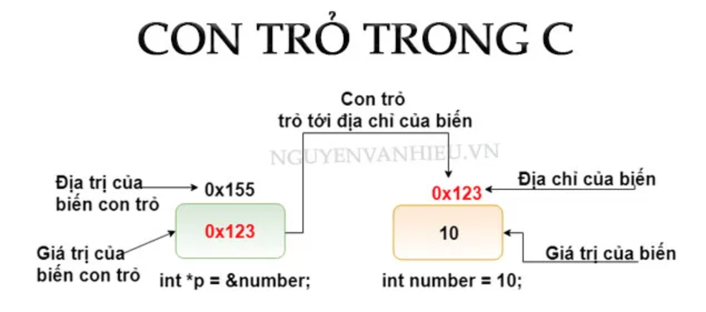
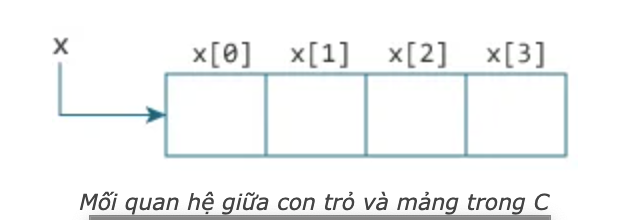
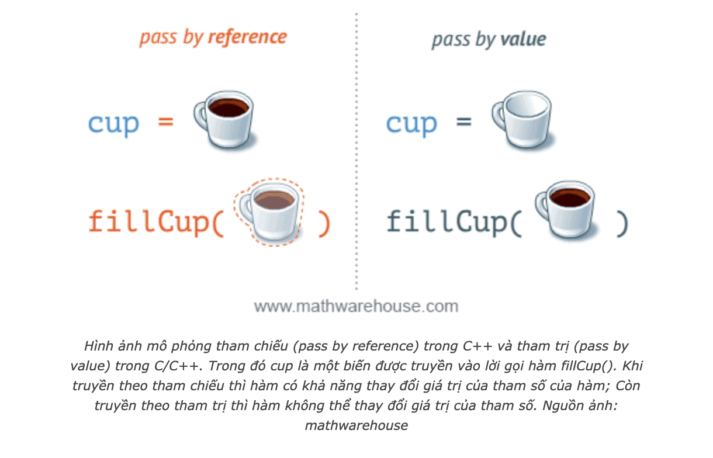

### 1. KIẾN THỨC CƠ BẢN CON TRỎ TRONG C

Nguồn: https://nguyenvanhieu.vn/con-tro-trong-c/
Chương trình ví dụ:

```c
#include <stdio.h>

int main ()
{

  int number = 10;

  int *p = &number;

  printf("&number=%d\n", &number);
  printf("number=%d\n", number);
  printf("----------\n");
  printf("p=%d\n", p);
  printf("&p=%d\n", &p);
  printf("*p=%d", *p);

  return 0;
}
```

Kết quả nhận được:

```c
&number=-1300913484
number=10
----------
p=-1300913484
&p=-1300913480
*p=10
```

Biết:

- `&number`: là địa chỉ ô nhớ của biến number.
- `number`: là giá trị của biến number đươc lưu tại địa chỉ `&number`.

Như vậy sau khi chạy lệnh `int *p = &number` ta đoán được các thông số sau:

- `p = &number`: suy ra p lưu địa chỉ của biến number. Hay nói đúng hơn **giá trị** của p là địa chỉ của biến number &#8594; **p trỏ đến địa chỉ bộ nhớ của biến number**
- `*p = number`: suy ra \*p mang giá trị của biến number.
- Giá trị còn lại là `&p`: nó đơn chỉ là địa chỉ của con trỏ p.



#### **1. Địa chỉ của biến C**

```c
int number;
printf("\nNhap number = ");
scanf("%d", &number);
printf("\nnumber = %d", number);
```

_Tại sao khi dùng hàm scanf chúng ta cần truyền vào &number? Còn hàm printf ta lại không có dấu & kia?_
&#8594; Bởi vì nếu bạn muốn nhập giá trị cho biến, hàm **scanf** cần biết địa chỉ của biến đó ở trong bộ nhớ.
&#8594; Mỗi biến mà bạn khai báo đều có địa chỉ riêng của nó và giá trị mà nó đang lưu trữ. Để xem được địa chỉ của biến, bạn thêm dấu & vào trước tên biến.

**Chú ý**:
Bạn có thể sẽ nhận được các địa chỉ khác nhau mỗi khi chạy code.

#### **2. Con trỏ trong C**

- Con trỏ trong C cũng chỉ là biến, cũng có thể **khai báo**, **khởi tạo** và lưu trữ **giá trị** và có **địa chỉ** của riêng nó.
- Con trỏ không lưu giá trị bình thường, nó là biến trỏ tới 1 địa chỉ khác, tức mang giá trị là 1 **địa chỉ**.

**Cách khai báo con trỏ**:
Con trỏ trong C cũng có thể khai báo giống như biến bình thường, tên biến là một định danh hợp lệ. Cú pháp như sau:

```c
<kiểu dữ liệu> * <tên biến>
```

Trong đó:

- Kiểu dữ liệu có thể là: void, int, float, double,…
- Dấu \* trước tên biến là ký hiệu báo cho trình biên dịch biết ta đang khai báo con trỏ.

Ví dụ:

```c
int *p_i; // khai báo con trỏ để trỏ tới biến kiểu nguyên
int *p, val; // khai báo con trỏ p kiểu int, biến val (không phải con trỏ) kiểu int
float *p_f; // khai báo con trỏ để trỏ tới biến kiểu thực
char *p_char; // khai báo con trỏ để trỏ tới biến kiểu ký tự
void *p_v; // con trỏ kiểu void (không kiểu)
```

**Gán giá trị cho con trỏ**

- Nếu con trỏ được sử dụng mà không được khởi tạo, giá trị của nó sẽ là giá trị rác

```c
int *p, value;
value = 5;
p = &value; // khởi tạo giá trị cho con trỏ p là địa chỉ của value
```

Hoặc bạn cũng có thể khai báo và khởi tạo đồng thời:

```c
int value = 5;
int *p = &value; // khai báo con trỏ p và khởi tạo giá trị cho con trỏ là địa chỉ của value
```

**Lưu ý**:

- Con trỏ khi khai báo nên được khởi tạo giá trị ngay.
- Con trỏ kiểu void là loại biến con trỏ tổng quát, nó có thể nhận địa chỉ của biến bất kỳ ở bất cứ kiểu dữ liệu nào.
- Con trỏ kiểu `float` không thể trỏ đến con trỏ kiểu `int`,... &#8594; chỉ trỏ được khi cùng kiểu
- Khởi tạo con trỏ bằng địa chỉ NULL `int *p = NULL` khi đó con trỏ NULL có giá trị là 0.

**Bản chất của con trỏ trong C**
```c
#include <stdio.h>
int main()
{
  // Khai báo + khởi tạo biến
  int value = 10;

  printf("\nGia tri cua `value` = %d", value);
  printf("\nDia tri cua `value` = %d", &value);

  printf("\n-------------------\n");

  /*
  Khai báo + khởi tạo biến con trỏ p
  có giá trị là địa chỉ của biến value
  */
  int *p = &value;

  printf("\nGia tri cua con tro `p` = %d", p);
  printf("\nDia tri cua con tro `p` = %d", &p);
  printf("\nGia tri cua bien ma con tro `p` dang tro toi = %d", *p);

  printf("\n-------------------\n");

  /*
  Thay đổi giá trị của biến value thông qua con trỏ p
  Giống như hàm scanf() có thể thay đổi giá trị của biến khi nhận vào địa chỉ,
  con trỏ khi có địa chỉ của 1 biến hoàn toàn có thể thay đổi giá trị của
  biến đó theo cách dưới đây:
  */
  // Lấy giá trị của biến value
  printf("\nGia tri cua `value` = %d", value);
  // Thay đổi giá trị của biến value thông qua `p`
  *p = 100;
  // Lấy giá trị của biến value
  printf("\nGia tri cua `value` = %d", value);
  // Lấy giá trị của biến ma con trỏ p đang trỏ tới dùng toán tử *
  printf("\nGia tri cua bien ma con tro `p` dang tro toi = %d", *p);

  printf("\n-------------------\n");

  /*
  Việc lấy giá trị của biến thông qua con trỏ
  chỉ là 1 cách khác để lấy được giá trị của biến đó.

  */
  value = 1000;
  // Lấy giá trị của biến value
  printf("\nGia tri cua `value` = %d", value);
  // Lấy giá trị của biến ma con trỏ p đang trỏ tới dùng toán tử *
  printf("\nGia tri cua bien ma con tro `p` dang tro toi = %d", *p);
}
```

Kết quả chạy:

```c
Gia tri cua `value` = 10
Dia tri cua `value` = 6487580
-------------------

Gia tri cua con tro `p` = 6487580
Dia tri cua con tro `p` = 6487568
Gia tri cua bien ma con tro `p` dang tro toi = 10
-------------------

Gia tri cua `value` = 10
Gia tri cua `value` = 100
Gia tri cua bien ma con tro `p` dang tro toi = 100
-------------------

Gia tri cua `value` = 1000
Gia tri cua bien ma con tro `p` dang tro toi = 1000
```

Qua ví dụ này, bạn có thể thấy rõ sự đúng đắn của các kết luận sau đây về con trỏ:

- Địa chỉ của biến value chính là giá trị của con trỏ p, đều là 6487580. Mỗi lần chạy có thể khác nhau.
- Con trỏ có thể lấy giá trị của biến mà nó đang trỏ tới bằng toán tử \*
- Con trỏ có thể thay đổi giá trị của biến mà nó đang trỏ tới. Do nó mang địa chỉ của biến, khi đó nó hoàn toàn có quyền thay đổi giá trị của biến đó.

**Các lỗi thường gặp với con trỏ**

```c
int value, *p;

// Sai! p cần địa chỉ,
// value không phải là cái địa chỉ đó.
p = value;

// Sai! *p là giá trị của biến mà con trỏ đang trỏ tới,
// &value là địa chỉ.
*p = &value;

// Đúng rồi! p cần 1 địa chỉ,
// &value là địa chỉ của biến value.
p = &value;

// Đúng! *p là giá trị của biến mà con trỏ đang trỏ tới, và
// c cũng là giá trị (không phải địa chỉ).
*p = value;
```

Các bạn khi mới học con trỏ sẽ mông lung về dấu \* ở phần khai báo và khi lấy giá trị của biến mà con trỏ đang trỏ tới:

```c
#include <stdio.h>
int main()
{
    int c = 5;
    // Dấu * ở đây để chúng ta biết chúng ta đang khai báo con trỏ.
    // Không phải lấy giá trị của nó nhé
    int *p = &c;
    // Khai báo trên tương đương
    // int *p;
    // p = &c;
    // Nếu bạn muốn phân biệt 2 thằng này, khi khai báo có thể viết như sau:
    // int* p = &c;

    // Lấy giá chỉ của biến mà con trỏ đang trỏ tới, chính là giá trị của c
    printf("%d", *p); // 5
}
```

---

### 2. MỐI QUAN HỆ GIỮA CON TRỎ VÀ MẢNG

Nguồn: https://nguyenvanhieu.vn/moi-quan-he-giua-con-tro-va-mang/
**Các phần tử của mảng là các ô nhớ liên tiếp**

Nhắc lại khái niệm về mảng: _“Mảng là một tập hợp tuần tự các phần tử có cùng kiểu dữ liệu và các phần tử được lưu trữ trong một dãy các ô nhớ liên tục trên bộ nhớ“_.

```c
#include <stdio.h>
int main(){
    // Khai báo mảng có 5 phần tử
    int arr[] = {1, 2, 3, 4, 5};

    printf("Dia chi cua mang arr = %d\n", &arr);
    printf("Gia chi cua mang arr = %d\n", arr);
    // Thử in địa chỉ của từng phần tử
    // sizeof (arr): Kích thước của mảng
    // sizeof (int): Kích thước của kiểu int
    for(int i = 0; i < sizeof (arr) / sizeof (int); i++){
        printf("Dia chi cua arr[%d] = %d\n", i, &arr[i]);
    }

}
```

Kết quả chạy chương trình:

```c
Dia chi cua mang arr = 6487552
Gia chi cua mang arr = 6487552
Dia chi cua arr[0] = 6487552
Dia chi cua arr[1] = 6487556
Dia chi cua arr[2] = 6487560
Dia chi cua arr[3] = 6487564
Dia chi cua arr[4] = 6487568
```

**Nhận xét**:

- Các phần tử liên tiếp có địa chỉ cách nhau 4 giá trị, bởi vì 1 phần tử kiểu int có kích thước 4 bytes (máy tính x64). Nên ta chắc chắn các phần tử mảng được xếp cạnh nhau trong bộ nhớ.
- Trong ví dụ này thấy rằng, địa chỉ của biến mảng chính là địa chỉ của phần tử đầu tiên của mảng. Và giá trị của biến mảng cũng chính là địa chỉ của phần tử đầu tiên của mảng.
- Như vậy, &arr[0] tương đương &arr và tương đương arr. Điều đó có được là do biến arr trỏ tới phần tử đầu tiên của mảng.

**Toán tử tăng và giảm của con trỏ**

```c
#include <stdio.h>

int main()
{
    // Khai báo mảng có 5 phần tử
    int arr[] = {1, 2, 3, 4, 5};
    // Thử in địa chỉ của từng phần tử
    // sizeof (arr): Kích thước của mảng
    // sizeof (int): Kích thước của kiểu int
    for (int i = 0; i < sizeof(arr) / sizeof(int); i++)
    {
        printf("Dia chi cua arr[%d] = %d\n", i, &arr[i]);
    }

    printf("\n___________________________\n");

    // Gán con trỏ p cho phần tử đầu tiên của mảng
    int *p = &arr[0];

    printf("Gia tri cua con tro p = %d\n", p);
    printf("Gia tri cua dia chi ma p dang tro den = %d\n", *p);

    // Toán tử tăng trên con trỏ
    p++; // hoặc p = p + 1;

    printf("Gia tri cua con tro p = %d\n", p);
    printf("Gia tri cua dia chi ma p dang tro den = %d\n", *p);

    // Toán tử tăng trên con trỏ
    p += 2; // hoặc p = p + 2;
    printf("Gia tri cua con tro p = %d\n", p);
    printf("Gia tri cua dia chi ma p dang tro den = %d\n", *p);

    // Toán tử giảm trên con trỏ
    p--; // hoặc p = p - 1;
    printf("Gia tri cua con tro p = %d\n", p);
    printf("Gia tri cua dia chi ma p dang tro den = %d\n", *p);
}
```

**Kết quả chạy:**

```c
Dia chi cua arr[0] = 6487536
Dia chi cua arr[1] = 6487540
Dia chi cua arr[2] = 6487544
Dia chi cua arr[3] = 6487548
Dia chi cua arr[4] = 6487552

___________________________
Gia tri cua con tro p = 6487536
Gia tri cua dia chi ma p dang tro den = 1
Gia tri cua con tro p = 6487540
Gia tri cua dia chi ma p dang tro den = 2
Gia tri cua con tro p = 6487548
Gia tri cua dia chi ma p dang tro den = 4
Gia tri cua con tro p = 6487544
Gia tri cua dia chi ma p dang tro den = 3
```

Như bạn thấy:

- Khi dùng toán tử tăng/ giảm trên biến con trỏ, nó sẽ nhảy sang **ô nhớ liền kề** chứ không phải tăng địa chỉ mà nó đang trỏ lên 1. Do con trỏ p là kiểu int nên mỗi bước tăng, giá trị của p **tăng thêm 4** giá trị. (Lưu ý: **giá trị** của con trỏ **là địa chỉ** mà nó đang trỏ tới)
- Nếu bạn muốn tăng giá trị của địa chỉ nơi con trỏ đang trỏ tới, hãy dùng cách dưới đây:

```c
#include <stdio.h>

int main()
{
    // Khai báo mảng có 5 phần tử
    int arr[] = {1, 2, 3, 4, 5};

    // Gán con trỏ p cho phần tử đầu tiên của mảng
    int *p = &arr[0];
    printf("Gia tri cua dia chi ma p dang tro den = %d\n", *p);
    // Tăng giá trị của địa chỉ mà `p` đang trỏ tới thông qua `p`.
    (*p)+= 5;
    // Lấy giá trị của địa chỉ mà p đang trỏ đến
    printf("Gia tri cua dia chi ma p dang tro den = %d\n", *p);
}

// Gia tri cua dia chi ma p dang tro den = 1
// Gia tri cua dia chi ma p dang tro den = 6
```

**Mối quan hệ giữa con trỏ và mảng trong C:**

Tới đây chắc hẳn bạn đã hình dung được sự liên hệ giữa con trỏ và mảng, mình sẽ cùng các bạn đi tới các kết luận về con trỏ và mảng nhé.



Với mảng trong ảnh phía trên, ta có:

- `&x[0]` và `x` có cùng giá trị, và `x[0]` hay `*x` là tương đương nhau.
- `&x[1]` tương đương với `x+1` và `x[1]` tương đương với `*(x+1)`.
- `&x[2]` tương đương với `x+2` và `x[2]` tương đương với `*(x+2)`.
  …
- Tóm lại, `&x[i]` tương đương với `x+i` và `x[i]` tương đương với `*(x+i)`.

Hãy thử nhập xuất mảng theo cách mới nào:

```c
// Ví dụ mối quan hệ giữa con trỏ và mảng - Lập Trình Không Khó
#include <stdio.h>

#define MAX_SIZE 100

int main()
{
    int arr[MAX_SIZE];
    int n;
    do
    {
        printf("Nhap so luong phan tu: ");
        scanf("%d", &n);
    } while (n < 1);

    // Nhập mảng
    for (int i = 0; i < n; i++)
    {
        printf("Nhap a[%d] = ", i);
        scanf("%d", (arr + i));
    }

    // Xuất mảng
    for (int i = 0; i < n; i++)
    {
        printf("\nGia tri a[%d] = %d", i, *(arr + i));
    }
}
```

Kết quả chạy:

```c
Nhap so luong phan tu: 5
Nhap a[0] = 1
Nhap a[1] = 2
Nhap a[2] = 3
Nhap a[3] = 4
Nhap a[4] = 5

Gia tri a[0] = 1
Gia tri a[1] = 2
Gia tri a[2] = 3
Gia tri a[3] = 4
Gia tri a[4] = 5
```

**Ví dụ**
**Dùng con trỏ để nhập và duyệt mảng như thế nào?**

```c
// Ví dụ mối quan hệ giữa con trỏ và mảng
#include <stdio.h>
#define MAX_SIZE 100

int main()
{
    int arr[MAX_SIZE];
    int n;
    do
    {
        printf("Nhap so luong phan tu: ");
        scanf("%d", &n);
    } while (n < 1);

    int *p = &arr[0];
    // Nhập mảng
    for (int i = 0; i < n; i++)
    {
        printf("Nhap a[%d] = ", i);
        scanf("%d", (p + i));
    }

    // Xuất mảng
    for (int i = 0; i < n; i++)
    {
        printf("\nGia tri a[%d] = %d", i, *(p + i));
    }

    int sum = 0;
    for(int *i = &arr[0]; i <= &arr[n-1]; i++){
        // Lấy giá trị của phần tử hiện tại bằng toán tử `*`
        sum += *i;
    }
    printf("\nSum = %d", sum);
}
```

Kết quả chạy chương trình:

```c
Nhap so luong phan tu: 5
Nhap a[0] = 1
Nhap a[1] = 2
Nhap a[2] = 3
Nhap a[3] = 4
Nhap a[4] = 5

Gia tri a[0] = 1
Gia tri a[1] = 2
Gia tri a[2] = 3
Gia tri a[3] = 4
Gia tri a[4] = 5
Sum = 15
```

&#8594; Cách để duyệt mảng cực ngầu :)

### 3. CON TRỎ VÀ HÀM TRONG C

**Mối liên hệ giữa con trỏ và hàm**
Nguồn: https://nguyenvanhieu.vn/con-tro-va-ham-trong-c/



**Tham chiếu trong c**
Lưu ý: Tham chiếu là khái niệm chỉ có trong C++. Với C, cách tương tự để truyền tham chiếu là sử dụng truyền con trỏ. Với tham trị (truyền giá trị) thì C và C++ là giống nhau.

Hàm hoán vị 2 số nguyên:

```c
#include <stdio.h>

void swap(int a, int b){
    printf("Ham con, truoc khi goi ham hoan vi, a = %d, b = %d\n", a , b);
    int tmp = a;
    a = b;
    b = tmp;
    printf("Ham con, sau khi goi ham hoan vi, a = %d, b = %d\n", a , b);
}

int main(){
    int a = 5, b = 7;
    printf("Ham main, truoc khi goi ham hoan vi, a = %d, b = %d\n", a , b);
    swap(a, b);
    printf("Ham main, sau khi goi ham hoan vi, a = %d, b = %d\n", a , b);
}
```

Kết quả chạy:

```c
Ham main, truoc khi goi ham hoan vi, a = 5, b = 7
Ham con, truoc khi goi ham hoan vi, a = 5, b = 7
Ham con, sau khi goi ham hoan vi, a = 7, b = 5
Ham main, sau khi goi ham hoan vi, a = 5, b = 7
```

&#8594; Hàm con không thay đổi giá trị của biến a và b trong hàm `main()`.
&#8594; Đang truyền bởi tham trị – nghĩa là khi hàm `swap()` được gọi thì 2 tham số đó sẽ được hàm này sao chép sang 2 vùng nhớ mới, mọi thay đổi được thực hiện trên bản sao này.

_Bây giờ, ta hãy thử truyền con trỏ như sau:_

```c
#include <stdio.h>


// Tham số đầu vào là 2 biến con trỏ kiểu int
void swap(int *a, int *b){
    // dùng * để lấy giá trị của biến mà con trỏ đang trỏ tới
    printf("Ham con, truoc khi goi ham hoan vi, a = %d, b = %d\n", *a , *b);
    // dùng * để lấy giá trị của biến mà con trỏ a đang trỏ tới và gán cho biến `tmp`
    int tmp = *a;
    // sửa giá trị của biến mà con trỏ a đang trỏ tới,
    // bằng giá trị của biến mà con trỏ b đang trỏ tới
    *a = *b;
    // sửa giá trị của biến mà con trỏ a đang trỏ tới,
    // bằng giá trị của của biến con trỏ a đang trỏ tới, đang được lưu trong `tmp`
    *b = tmp;
    // dùng * để lấy giá trị của biến mà con trỏ đang trỏ tới
    printf("Ham con, sau khi goi ham hoan vi, a = %d, b = %d\n", *a , *b);
}

int main(){
    int a = 5, b = 7;
    printf("Ham main, truoc khi goi ham hoan vi, a = %d, b = %d\n", a , b);

    // Do tham số hàm là 2 con trỏ, ta cần truyền vào địa chỉ
    // Dùng & để lấy địa chỉ của biến.
    swap(&a, &b);
    printf("Ham main, sau khi goi ham hoan vi, a = %d, b = %d\n", a , b);
}
```

Kết quả chạy:

```c
Ham main, truoc khi goi ham hoan vi, a = 5, b = 7
Ham con, truoc khi goi ham hoan vi, a = 5, b = 7
Ham con, sau khi goi ham hoan vi, a = 7, b = 5
Ham main, sau khi goi ham hoan vi, a = 7, b = 5
```

&#8594; Khi ta có địa chỉ của biến (con trỏ lưu) thì ta có thể thay đổi giá trị của biến mà con trỏ đang trỏ tới. Đó chính là cách truyền con trỏ trong C.

**Truyền con trỏ vào hàm trong C**

- Bạn đã quá quen thuộc với việc truyền giá trị vào hàm – truyền tham trị như đoạn code đầu tiên của bài.
- Ở phần này, chúng ta sẽ xem xét cách truyền con trỏ vào hàm trong C như thế nào.

```c
#include <stdio.h>

void addOne(int *ptr)
{
    // Tăng giá trị của biến nơi con trỏ đang trỏ đến lên 1 đơn vị.
    (*ptr)++;
}

int main()
{
    int *p, i = 10;
    p = &i;
    addOne(p);
    printf("%d", *p); // 11
    return 0;
}
```

Trong ví dụ trên:

- Chúng ta truyền con trỏ `p` vào hàm `addOne()`, hàm này có chức năng tăng giá trị của biến nơi con trỏ đang trỏ tới.
- Vì ta truyền vào biến con trỏ nên giá trị của `p` trong hàm `main() `cũng sẽ bị thay đổi.

### 4. CẤP PHÁT BỘ NHỚ ĐỘNG TRONG C

**Tại sao cần cấp phát bộ nhớ động?**
Bạn đã biết:

- Mảng là một tập hợp của các phần tử nằm liên tiếp nhau trên bộ nhớ và có cùng kiểu dữ liệu.
- Khi khai báo mảng, bạn phải chỉ định rõ kích thước tối đa (số lượng phần tử tối đa). Và sau khi khai báo, bạn không thể thay đổi kích thước của mảng
  &#8594; **Cấp phát tĩnh**.

Đôi khi kích thước mảng của bạn khai báo có thể thiếu, cũng có thể dư thừa gây lãng phí bộ nhớ.
Dưới đây là bảng so sánh giữa cấp phát bộ nhớ động và tĩnh:
| Cấp phát tĩnh | Cấp phát động |
| ------------- | ------------- |
| Bộ nhớ được cấp phát trước khi chạy chương trình (trong quá trình biên dịch) | Bộ nhớ được cấp phát trong quá trình chạy chương trình. |
| Không thể cấp phát hay phân bổ lại bộ nhớ trong khi chạy chương trình | Cho phép quản lý, phân bổ hay giải phóng bộ nhớ trong khi chạy chương trình |
|Vùng nhớ được cấp phát và tồn tại cho đến khi kết thúc chương trình|Chỉ cấp phát vùng nhớ khi cần sử dụng tới|
|Chương trình chạy nhanh hơn so với cấp phát động|Chương trình chạy chậm hơn so với cấp phát tĩnh|
|Tốn nhiều không gian bộ nhớ hơn|Tiết kiệm được không gian bộ nhớ sử dụng|

- **Ưu điểm** chính của việc sử dụng cấp phát động là giúp ta **tiết kiệm** được không gian bộ nhớ mà chương trình sử dụng. Bởi vì chúng ta sẽ chỉ **cấp phát** khi cần dùng và có thể **giải phóng** vùng nhớ đó ngay sau khi sử dụng xong.
- **Nhược điểm** chính của cấp phát động là bạn phải tự quản lý vùng nhớ mà bạn cấp phát. Nếu bạn cứ cấp phát mà quên giải phóng bộ nhớ thì chương trình của bạn sẽ tiêu thụ hết tài nguyên của máy tính dẫn đến tình trạng **tràn bộ nhớ** (memory leak).

**Cấp phát bộ nhớ động trong C**

- Sử dụng hàm `malloc()` hoặc hàm `calloc()` để cấp phát động.
- Sử dụng hàm `free()` để giải phóng bộ nhớ đã cấp phát khi không cần sử dụng.
- Sử dụng `realloc()` để thay đổi (phân bổ lại) kích thước bộ nhớ đã cấp phát trong khi chạy chương trình.

1. **Sử dụng hàm malloc()**

- Từ `malloc` là đại diện cho cụm từ `memory allocation` (dịch: cấp phát bộ nhớ).
- Hàm `malloc()` thực hiện cấp phát bộ nhớ bằng cách chỉ định số `byte` cần cấp phát. Hàm này trả về con trỏ kiểu `void` cho phép chúng ta có thể ép kiểu về bất cứ kiểu dữ liệu nào.
- Cú pháp của hàm `malloc()`:
  ```c
  ptr = (castType*) malloc(size);
  ```
  Ví dụ:
  ```c
  ptr = (int*) malloc(100 * sizeof(int));
  //cấp phát cho việc lưu trữ 100 số nguyên
  //khi đó lệnh dưới đây thực hiện cấp phát 400 bytes
  //con trỏ ptr sẽ có giá trị là địa chỉ của byte dữ liệu đầu tiên trong khối bộ nhớ vừa cấp phát
  ```

2. **Sử dụng hàm calloc()**

- Từ `calloc` đại diện cho cụm từ `contiguous allocation` (dịch: cấp phát liên tục).
- Hàm `malloc()` khi cấp phát bộ nhớ thì vùng nhớ cấp phát đó không được khởi tạo giá trị ban đầu. Trong khi đó, hàm calloc() thực hiện cấp phát bộ nhớ và khởi tạo tất cả các ô nhớ có **giá trị bằng 0**.
- Hàm `calloc()` nhận vào 2 tham số là số ô nhớ muốn khởi tạo và kích thước của 1 ô nhớ.

- Cú pháp của hàm `calloc()`:
  ```c
    ptr = (castType*)calloc(n, size);
  ```
  Ví dụ:
  ```c
  ptr = (int*) calloc(100, sizeof(int));
  ```
  Hàm `calloc()` thực hiện cấp phát 100 ô nhớ liên tiếp và mỗi ô nhớ có kích thước là số byte của kiểu int. Hàm này cũng trả về con trỏ chứa giá trị là địa chỉ của byte đầu tiên trong khối bộ nhớ vừa cấp phát.

3. **Sử dụng hàm `free()`**

- Việc cấp phát bộ nhớ động trong C dù sử dụng malloc() hay calloc() thì chúng cũng đều không thể tự giải phóng bộ nhớ. Bạn cần sử dụng hàm free() để giải phóng vùng nhớ.
- Cú pháp:

```c
free(ptr); // ptr là con trỏ
```

4. **Ví dụ sử dụng malloc() và free()**

```c
#include <stdio.h>
// Thư viện này cần để cấp phát bộ nhớ động
#include <stdlib.h>

int main()
{
    int n, i, *ptr, sum = 0;
    printf("Nhap so luong phan tu: ");
    scanf("%d", &n);
    ptr = (int *)malloc(n * sizeof(int));

    // Nếu không thể cấp phát,
    // hàm malloc sẽ trả về con trỏ NULL
    if (ptr == NULL)
    {
        printf("Co loi! khong the cap phat bo nho.");
        exit(0);
    }
    printf("Nhap cac gia tri: ");
    for (i = 0; i < n; ++i)
    {
        scanf("%d", ptr + i);
        sum += *(ptr + i);
    }
    printf("Tong = %d", sum);

    // Giải phóng vùng nhớ cho con trỏ
    free(ptr);
    return 0;
```

5. **Ví dụ sử dụng calloc() và free()**

```c
#include <stdio.h>
// Thư viện này cần để cấp phát bộ nhớ động
#include <stdlib.h>

int main()
{
    int n, i, *ptr, sum = 0;
    printf("Nhap so luong phan tu: ");
    scanf("%d", &n);
    ptr = (int *)calloc(n, sizeof(int));

    // Nếu không thể cấp phát,
    // hàm calloc sẽ trả về con trỏ NULL
    if (ptr == NULL)
    {
        printf("Co loi! khong the cap phat bo nho.");
        exit(0);
    }
    printf("Nhap cac gia tri: ");
    for (i = 0; i < n; ++i)
    {
        scanf("%d", ptr + i);
        sum += *(ptr + i);
    }
    printf("Tong = %d", sum);

    // Giải phóng vùng nhớ cho con trỏ
    free(ptr);
    return 0;
}
```

6. **Sử dụng hàm realloc()**

- Nếu việc cấp phát bộ nhớ động không đủ hoặc cần nhiều hơn mức đã cấp phát, bạn có thể thay đổi kích thước của bộ nhớ đã được cấp phát trước đó bằng cách sử dụng hàm realloc().
- Cú pháp của realloc():
  ```c
  ptr = realloc(ptr, n);
  ```
- Hàm này thực hiện cấp phát vùng nhớ mới cho con trỏ ptr. Vùng nhớ mới đó sẽ có kích thước mới là n bytes.

- Hàm này cũng trả về con trỏ chứa giá trị là địa chỉ của byte đầu tiên trong vùng nhớ mới. Hàm này sẽ cố gắng mở rộng số ô nhớ ra phía sau nếu có thể để giữ nguyên giá trị của con trỏ ban đầu. Trong trường hợp phải đổi sang một vùng nhớ khác, hàm `realloc()` cũng sẽ mang theo giá trị đã có ở vùng nhớ cũ sang vùng nhớ mới và giải phóng luôn vùng nhớ cũ. Trong trường hợp không thể, nó sẽ trả về con trỏ `NULL` giống như `malloc()` và `calloc()`.

7. **Ví dụ sử dụng hàm realloc()**

- Ví dụ dưới đây thì việc cấp phát không phải di chuyển sang vùng nhớ khác mà chỉ mở rộng ra phía sau.

  ```c
  #include <stdio.h>
  #include <stdlib.h>
  int main()
  {
    int *ptr, i , n1, n2;
    printf("Nhap so luong phan tu: ");
    scanf("%d", &n1);
    ptr = (int*) malloc(n1 * sizeof(int));
    printf("Dia chi cua vung nho vua cap phat: %u", ptr);

    printf("\nNhap lai so luong phan tu: ");
    scanf("%d", &n2);
    // phân bổ lại vùng nhớ
    ptr = (int*) realloc(ptr, n2 * sizeof(int));
    printf("Dia chi cua vung nho duoc cap phat lai: %u", ptr);
    // giải phóng
    free(ptr);
    return 0;
  }
  ```

  Kết quả chạy:

  ```c
  Nhap so luong phan tu: 2
  Dia chi cua vung nho vua cap phat: 1993360
  Nhap lai so luong phan tu: 100
  Dia chi cua vung nho duoc cap phat lai: 1993360
  ```

**Cấp phát mảng động 1 chiều**
```c
#include <stdio.h>
#include <stdlib.h>
 
void NhapMang(int *arr, int n)
{
    for (int i = 0; i < n; i++)
    {
        printf("arr[%d] = ", i);
        // Do giá trị con trỏ là địa chỉ rồi. Nên bạn sẽ không thấy dấu & quen thuộc nữa
        scanf("%d", (arr + i));
    }
}
 
void XuatMang(int *arr, int n)
{
    for (int i = 0; i < n; i++)
    {
        printf("arr[%d] = %d\n", i, *(arr + i));
    }
}
 
void ThemPhanTu(int *a, int &n, int val, int pos)
{
    // Phân bổ lại bộ nhớ đã cấp phát cho con trỏ.
    // Ta cần thêm 1 ô nhớ cho nó => dùng realloc()
    a = (int *)realloc(a, (n + 1) * sizeof(int));
    // Neu pos <= 0 => Them vao dau
    if (pos < 0) pos = 0;
    // Neu pos >= n => Them vao cuoi
    else if (pos > n) pos = n;

    // Dich chuyen mang de tao o trong truoc khi them.
    for (int i = n; i > pos; i--)
    {
        *(a + i) = *(a + i - 1);
    }
    // Chen val tai pos
    *(a + pos) = val;
    // Tang so luong phan tu sau khi chen.
    ++n;
}
void XoaPhanTu(int *a, int &n, int pos)
{
    // Mang rong, khong the xoa.
    if (n <= 0) return;

    // Neu pos <= 0 => Xoa dau
    if (pos < 0) pos = 0;
    // Neu pos >= n => Xoa cuoi
    else if (pos >= n) pos = n - 1;
    // Dich chuyen mang
    for (int i = pos; i < n - 1; i++)
    {
        a[i] = a[i + 1];
    }
    // Cấp phát lại vùng nhớ, giờ ta chỉ cần n - 1 ô nhớ
    a = (int *)realloc(a, (n - 1) * sizeof(int));
    // Giam so luong phan tu sau khi xoa.
    --n;
}
int main()
{
    int *arr;
    int n;
    do
    {
        printf("Nhap so luong n = ");
        scanf("%d", &n);
    } while (n < 1);
 
    // cấp phát đủ sài
    arr = (int *)malloc(n * sizeof(int));
    // arr = (int*) calloc(n, sizeof(int));
 
    if (arr == NULL)
    {
        printf("Khong the cap phat!");
        exit(0);
    }
 
    NhapMang(arr, n);
    printf("\nMang vua nhap la:\n");
    XuatMang(arr, n);
 
    printf("\n=======THEM PHAN TU======\n");
    int val, pos;
    printf("\nNhap so can them: ");
    scanf("%d", &val);
    printf("\nNhap vi tri muon chen: ");
    scanf("%d", &pos);
    ThemPhanTu(arr, n, val, pos);
    printf("\nMang sau khi them:\n");
    XuatMang(arr, n);
 
    printf("\n=======XOA PHAN TU======\n");
    printf("\nNhap vi tri muon xoa: ");
    scanf("%d", &pos);
    XoaPhanTu(arr, n, pos);
    printf("\nMang sau khi xoa:\n");
    XuatMang(arr, n);
    // giải phóng
    free(arr);
}
```

Kết quả chạy chương trình:
```c
Nhap so luong n = 3
arr[0] = 1
arr[1] = 2
arr[2] = 3
 
Mang vua nhap la:
arr[0] = 1
arr[1] = 2
arr[2] = 3
 
=======THEM PHAN TU======
 
Nhap so can them: 4
 
Nhap vi tri muon chen: 4
 
Mang sau khi them:
arr[0] = 1
arr[1] = 2
arr[2] = 3
arr[3] = 4
 
=======XOA PHAN TU======
 
Nhap vi tri muon xoa: 4
 
Mang sau khi xoa:
arr[0] = 1
arr[1] = 2
arr[2] = 3
```
