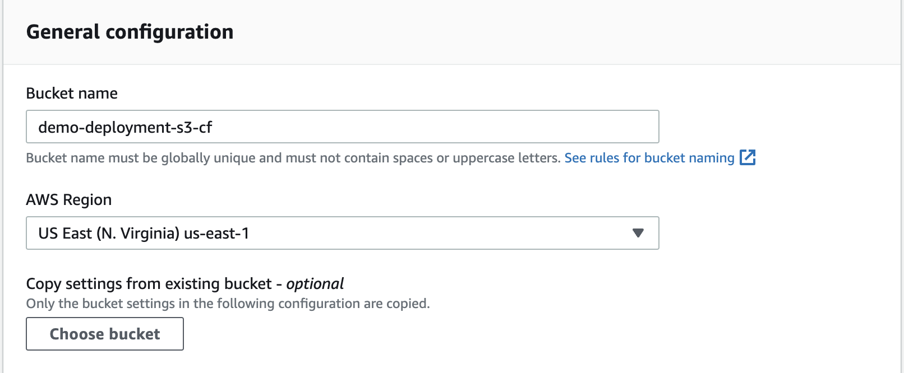
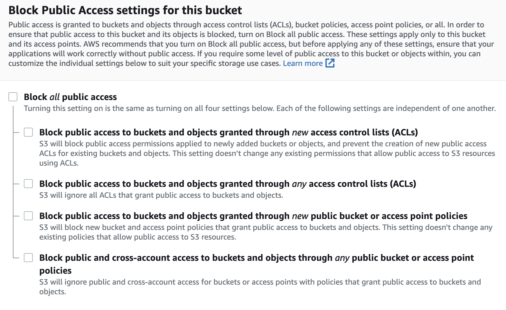
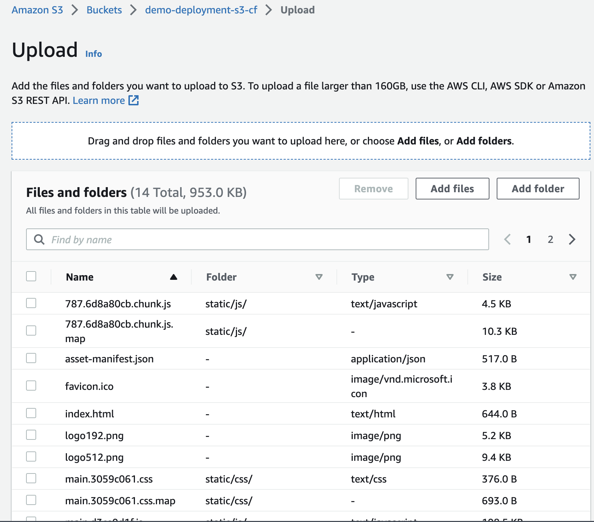
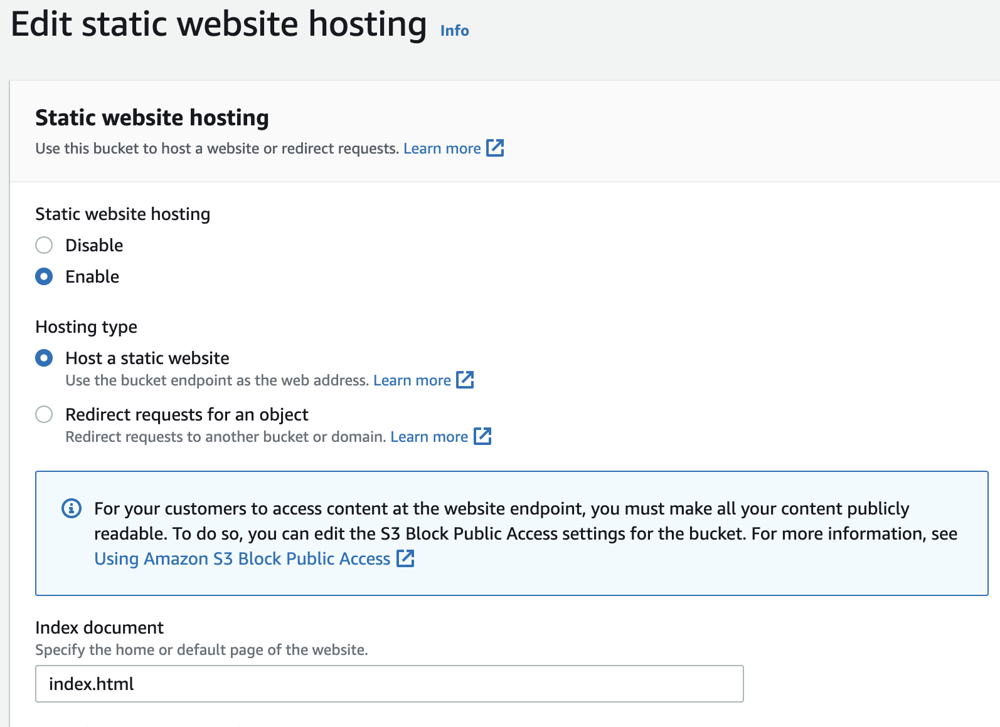
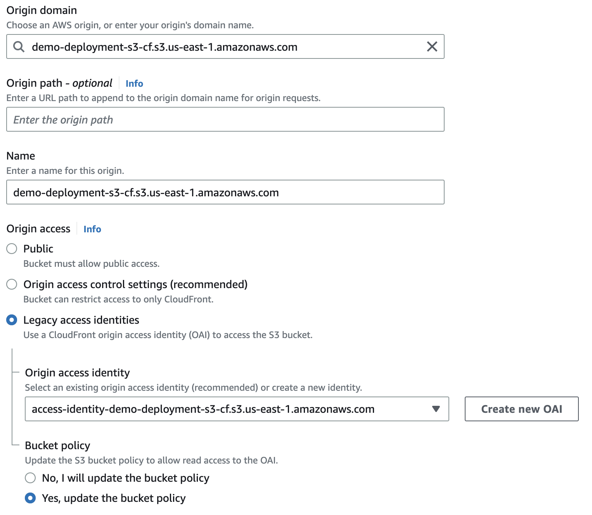

## STEPS TO DEPLOY REACT APP TO S3, CLOUDFRONT AND AUTOMATE WITH GITHUB ACTION  

Table of contents:
1. [Create simple react app](#reactapp)
2. [Interactive with S3](#s3)
3. [Interactive with Cloudfront](#cloudfront)
4. [Github actions](#github)

Reference: https://antonputra.com/amazon/deploy-react-to-s3-and-cloudfront 
### 1. Create simple react app <a name='reactapp'></a>
- Create project
  ```bash
  npx create-react-app demo-deployment
  ```

- Install react-router-dom v6
    ```bash
    npm install react-router-dom@6 / 
    yarn add react-router-dom@6
    ```

- Create `src/pages/login.js`:
    ```js
    import React from "react";
    import { Link } from "react-router-dom";

    const LoginPage = () => {
    return (
        <div className="app">
        <h1>Login page</h1>
        <Link to="/signup">Go to signup</Link>
        <Link to="/">Back home</Link>
        </div>
    );
    };

    export default LoginPage;
    ```

- Create `src/pages/signup.js`:
  ```js
  import React from "react";
    import { Link } from "react-router-dom";

    const SignupPage = () => {
    return (
        <div className="app">
        <h1>Signup Page</h1>
        <Link to="/login">Go to login</Link>
        <Link to="/">Back home</Link>
        </div>
    );
    };

    export default SignupPage;
    ```

- Create `src/pages/home.js`:
  ```js
    import React from "react";
    import { Link } from "react-router-dom";

    const HomePage = () => {
    return (
        <div className="app">
        <h1>HOME PAGE</h1>
        <Link to="/login">Go to login</Link>
        <Link to="/signup">Go to signup</Link>
        </div>
    );
    };

    export default HomePage;

  ```

- Update `app.js`:
  ```js
    import { createBrowserRouter, RouterProvider } from "react-router-dom";
    import HomePage from "./pages/home";
    import LoginPage from "./pages/login";
    import SignupPage from "./pages/signup";

    import "./App.css";

    function App() {
    const router = createBrowserRouter([
        {
        path: "/",
        element: <HomePage />,
        },
        {
        path: "/login",
        element: <LoginPage />,
        },
        {
        path: "/signup",
        element: <SignupPage />,
        },
    ]);

    return <RouterProvider router={router} />;
    }

    export default App;
  ```


### 2. Interactive with S3 <a name='s3'></a>
- Create S3 bucket
  S3 → Create bucket → Input name → Select region → Uncheck `Block all public access` to able access file
    

    

- Run `npm run build / yarn build` in React app, and upload folder `build` to S3 bucket 
  

- After upload success, click tab `Properties` → Scroll down and click `edit` Static web hosting → Enable → Index document (index.html) → save changes
  

 - click tab `Permission` at `Bucket policty` click `edit` → paste below code → save changes
  ```json
    {
    "Version": "2012-10-17",
    "Statement": [
        {
            "Sid": "PublicReadGetObject",
            "Effect": "Allow",
            "Principal": "*",
            "Action": "s3:GetObject",
            "Resource": "arn:aws:s3:::demo-deployment-s3-cf/*"
        }
    ]
    }
  ```

- Now, you can access React app by s3 link which displayed at `Properties > Static website hosting > Bucket website endpoint`

### 3. Interactive with Cloudfront <a name='cloudfront'></a>
- Create distribution
  - Select origin domain (s3 url)
  - Origin access, select `Legacy access identities` 
  - Create new OAI
  - Bucket policy, `Yes, update the bucket policy`
  - Update other config if you want
    
- After the status shown is `deployed` you can access React app through `Distribution domain name`

### 4. Github actions <a name='github'></a>


