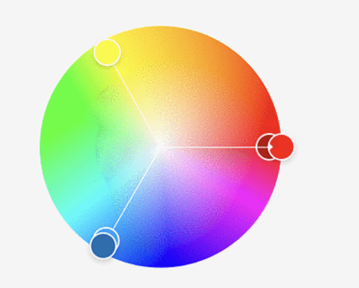

### 1. Hsl color
HSL stands for Hue, Saturation, and Lightness.

`hsl(hue, saturation, lightness)`

`hsla(hue, saturation, lightness, alpha)`

- Hue is a degree on the color wheel from 0 to 360. 0 (or 360) is red, 120 is green, 240 is blue.
- Saturation: 
  - 100% is full color, no shades of gray.
  - 50% is 50% gray
  - 0% is completely gray
- Lightness
  - 0% means no light
  - 50% means 50% light
  - 100% means full light
- The `alpha` parameter is a number between 0.0 (fully transparent) and 1.0 (not transparent at all)

